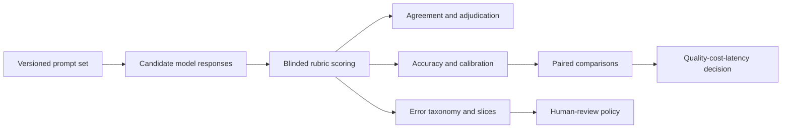

# LLM Evaluation and Error Analysis Lab

[](https://github.com/sagarmandavkar-UX/llm-evaluation-lab/actions/workflows/tests.yml)


A model-evaluation framework for treating AI output as a measurable product surface. It compares candidate systems on quality, uncertainty, calibration, latency, cost, domain slices, difficulty, error types, paired item-level differences, and inter-rater reliability.

> Model labels and results are synthetic. They demonstrate evaluation design and do not benchmark or rank actual commercial models.

## Executive result

The seeded fixture contains 240 common evaluation items per model. The synthetic `reasoning` system leads aggregate accuracy, while compact models remain faster and cheaper. Inter-rater agreement is strong (`κ ≈ 0.85`), but slice and error analyses show why aggregate accuracy is not a sufficient deployment criterion.

## Decision question

Which candidate model meets the use case's minimum quality and safety requirements at an acceptable cost and latency—and which prompt slices still require human review?

## What this project demonstrates

- Versionable, item-level evaluation schema.
- Bootstrap 95% confidence intervals for accuracy.
- Paired bootstrap model comparisons on common prompts.
- Domain and difficulty scorecards.
- Factual, instruction, calculation, and citation error taxonomy.
- Cohen's kappa for inter-rater agreement.
- Confidence calibration through Brier score.
- Quality–cost–latency frontier.
- Interactive scorecard and downloadable evaluation set.

## Architecture



## Repository structure

```text
├── evaluation.py            # metrics, bootstrap inference, validation
├── app.py                   # interactive evaluation dashboard
├── docs/                    # methodology, schema, decision memo
├── outputs/                 # scorecards, errors, paired comparisons
├── test_project.py
├── Dockerfile
├── Makefile
└── requirements.txt
```

## Quick start

```bash
git clone https://github.com/sagarmandavkar-UX/llm-evaluation-lab.git
cd llm-evaluation-lab
python -m venv .venv
source .venv/bin/activate
make setup
make analyze
make test
make dashboard
```

## Evaluation protocol

Freeze prompts and rubrics before comparing models. Blind raters to model identity, collect independent labels, adjudicate disagreements, and version every model/prompt/decoding configuration. Define the primary quality metric and severity-specific guardrails before inspecting results.

## Input contract

At minimum: `item_id`, `model`, `domain`, `difficulty`, `rater_1`, `rater_2`, and `error_type`. Optional professional metrics use `confidence`, `latency_ms`, and `cost_usd`.

## Limitations

The demo uses binary correctness and one primary error label. Real systems may need ordinal rubrics, refusal quality, factuality grounded in evidence, safety taxonomies, multiple error labels, annotator calibration sessions, and drift monitoring.

## Portfolio talking points

- Designed an AI evaluation system with paired inference rather than independent aggregate comparisons.
- Quantified human-label reliability and model confidence calibration.
- Converted error analysis into a deployment and human-review decision framework.

See [Methodology](docs/METHODOLOGY.md), [Data dictionary](docs/DATA_DICTIONARY.md), and [Executive memo](docs/EXECUTIVE_MEMO.md).
